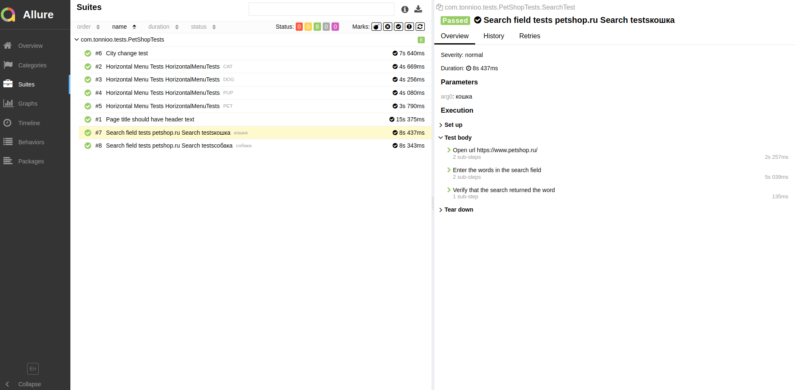

# Автоматизации тестирования интернет магазина:
# <a target="_blank" href="https://www.petshop.ru/">petshop.ru</a>


## Code stack
<p align="left">


</p>

## Инфраструктура
<p align="left">


</p>

## Implemented checks
-  
- Проверка заголовка страницы 
- Проверка горизонтального меню
- Проверка поля поиска 
- Проверка выбора города


## Сборка в Jenkins
### <a target="_blank" href="https://jenkins.autotests.cloud/job/tonnioo_petshop_tests/">Параметризированная сборка в Jenkins</a>
<p align="center">

</p>
<p align="center">

</p>

## Запуск из терминала
Локальный запуск всех тестов:
```
gradle clean test
```
Удаленный запуск всех тестов:
```
clean
test
 -Dbrowser=${BROWSER}
 -DbrowserVersion=${BROWSER_VERSION}
 -DbrowserSize=${BROWSER_SIZE}
 -DbaseUrl=${BASE_URL}
 -Dremote=${REMOTE}
```

## Allure отчет
- ### Главный экран отчета
<p align="center">

</p>

- ### Страница с проведенными тестами
<p align="center">

</p>

## Отчет в Telegram
<p align="center">

</p>

## Видео примеры прохождения тестов
> К каждому тесту в отчете прилагается видео. Одно из таких видео представлено ниже.
<p align="center">
  
</p>

